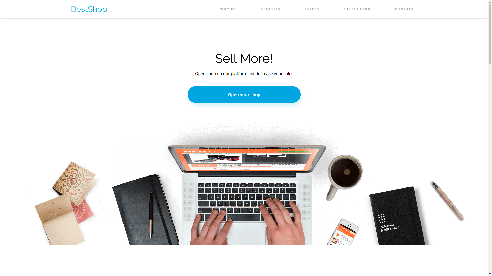
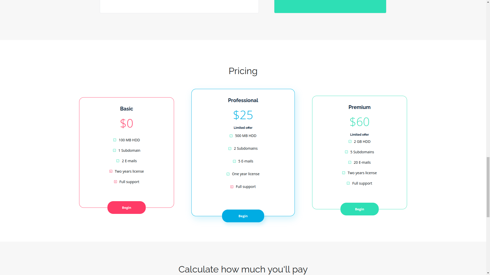
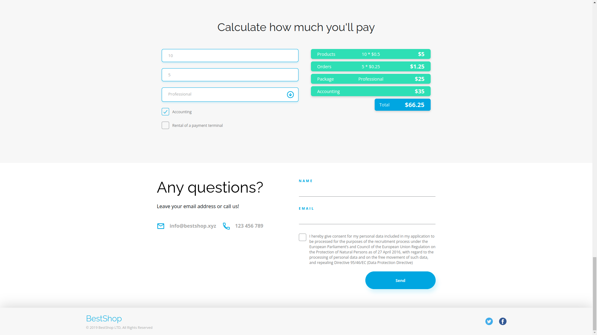

# BestShop

Przykładowa strona firmy oferującej zarządzanie sklepami online. Strona zawiera podstawowe informacje o działalności firmy: statystyki czy cennik. Dodatkowo strona zawiera formularz kontaktowy oraz kalkulator umożliwiający wstępną wycenę usług.

A sample website of a company offering online store management. The page contains basic information about the company's activity: statistics and price list. Additionally, the page contains a contact form and a calculator, which allows for pricing services.

## Demo

https://piotrhol.github.io/BestShop/

## Technologies

HTML, Sass, JavaScript, Gulp

## Example screenshots

- Page header

- Pricing section

- Calculator and contact form

